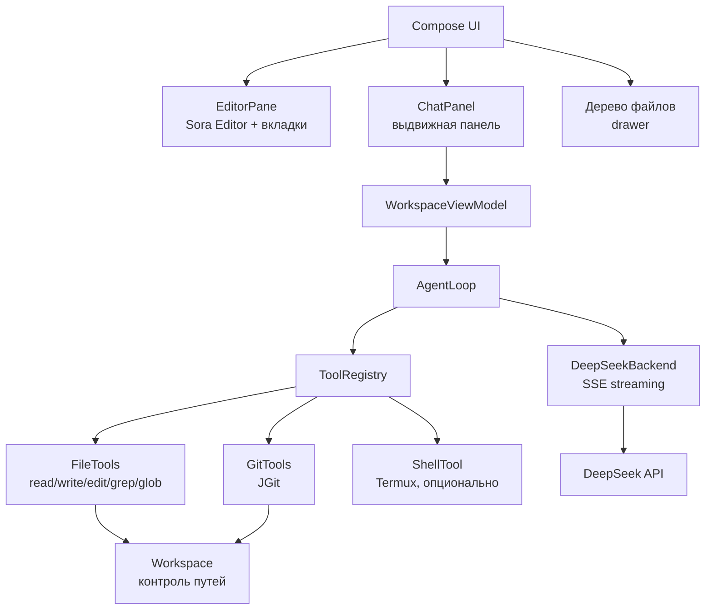
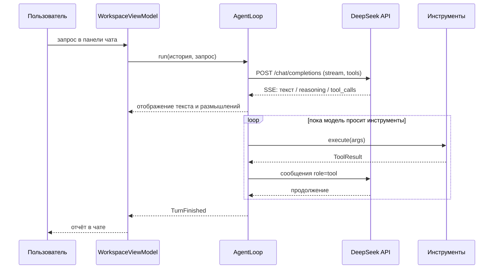

# CEditNeuro — передача проекта

Пакет с исходниками Android-редактора с встроенным агентским чатом на DeepSeek.
Архив: `CEditNeuro-0.1.0-src.zip` (или одноимённый по дате), внутри — корневая папка `CEditNeuro/`.

---

## 1. Что это и зачем

**CEditNeuro** (Complex Editor Neuro) — редактор кода для Android с агентским чатом, повторяющий
рабочий сценарий Zed на десктопе:

1. открыл проект и правишь файлы руками;
2. выдвинул панель чата и написал, что нужно сделать;
3. агент сам читает проект, правит файлы, проверяет и отчитывается;
4. закрыл панель и продолжил редактировать.

Ключевое отличие от «обёрток над ChatGPT»: агент — не просто чат, а **цикл с инструментами**
(чтение/запись/поиск/git), который реально меняет файлы в проекте. Всё работает на устройстве.

**Цель использования:** личный инструмент для своего сообщества (сайдлоад, не Play Store).

---

## 2. Схема архитектуры



Два принципа, на которых держится всё остальное:

**Агент — это интерфейс, а не вендор.** `AgentBackend` — точка расширения. `DeepSeekBackend` —
одна реализация; локальная модель или агент по протоколу ACP подставляются без изменения UI и
цикла. DeepSeek совместим с OpenAI API, поэтому клиент по сути универсальный + его расширения
`thinking` / `reasoning_effort`.

**Весь доступ к файлам идёт через `Workspace`.** `Workspace.resolve()` канонизирует путь и
отклоняет всё за пределами корня проекта. Это единственный барьер между запутавшейся моделью и
обходом `../../`, поэтому он узкий и обязательный.

---

## 3. Как работает агентский цикл



Предохранитель: `maxToolRounds` (по умолчанию 24) останавливает модель, которая бесконечно
вызывает инструменты.

---

## 4. Набор инструментов агента

| Инструмент | Назначение |
| --- | --- |
| `list_dir` | один уровень каталога |
| `read_file` | строки с нумерацией, постранично (offset/limit) |
| `write_file` | новые файлы или полная перезапись |
| `edit_file` | замена точной подстроки, с проверкой уникальности |
| `grep` | regex по содержимому + фильтр имён по glob |
| `glob` | поиск путей по шаблону |
| `git_status` | ветка и состояние рабочего дерева |
| `git_diff` | unified diff (рабочее дерево или индекс) |
| `run_command` | shell через Termux — регистрируется только если Termux есть |

`edit_file` отказывается работать, если `old_string` встречается больше одного раза и не передан
`replace_all`: молчаливая правка не в том месте дороже, чем повторный запрос модели.

---

## 5. Что сделано

| Область | Статус |
| --- | --- |
| Gradle-проект, version catalog, wrapper 8.9 | готово |
| Манифест, ресурсы, иконка, тема | готово |
| Безопасный доступ к ФС (`Workspace`) | готово |
| Дерево файлов, вкладки, редактор | готово |
| Агентский цикл с tool calling | готово |
| Стриминг DeepSeek (SSE, reasoning, tool calls) | готово |
| Инструменты: файлы | готово |
| Инструменты: git (JGit) | готово |
| Shell через Termux | готово, опционально |
| Выдвижная панель чата | готово |
| Настройки (ключ, модель, base URL) | готово |
| Подсветка синтаксиса (TextMate) | **нет** — упёрлись в тулчейн, см. §8 |
| LSP, tree-sitter | нет |
| Accept/Reject диффов как в Zed | нет — правки применяются сразу |

---

## 6. Карта файлов

```
CEditNeuro/
  .github/workflows/android.yml   CI: сборка debug APK
  app/build.gradle.kts            зависимости, minSdk 26, desugaring
  app/proguard-rules.pro          правила для JGit и kotlinx.serialization
  app/src/main/AndroidManifest.xml
  app/src/main/res/               строки, тема, adaptive-иконка
  app/src/main/java/com/hvkeyn/ceditneuro/
    CEditNeuroApp.kt              Application, точка доступа к настройкам
    MainActivity.kt               Compose-host
    agent/
      AgentBackend.kt             интерфейс модели + BackendChunk
      AgentEvents.kt              события для UI
      AgentLoop.kt                агентский цикл
      AgentModels.kt              ChatMessage / ToolCall
      Prompt.kt                   системный промпт
      deepseek/DeepSeekBackend.kt SSE-клиент, сборка tool calls
    data/SettingsStore.kt         ключ в EncryptedSharedPreferences
    tools/
      Tool.kt, ToolRegistry.kt    контракт инструмента
      FileTools.kt                read/write/edit/list/grep/glob
      GitTools.kt                 status/diff через JGit
      ShellTool.kt                Termux RUN_COMMAND
      TextDiff.kt                 LCS-дифф (пока только в ответах инструментов)
      JsonSupport.kt              доступ к аргументам, JSON Schema
    ui/
      WorkspaceScreen.kt          экран, дерево, top bar, доступ к хранилищу
      WorkspaceViewModel.kt       состояние, запуск агента, dirty-буферы
      editor/EditorPane.kt        вкладки + обёртка Sora Editor
      chat/ChatPanel.kt           панель чата
      settings/SettingsDialog.kt  настройки агента
      theme/Theme.kt              тёмная тема
    workspace/Workspace.kt        корень проекта + контроль путей
  docs/ARCHITECTURE.md            подробное обоснование решений
  HANDOFF.md                      этот документ
```

Всего 23 Kotlin-файла.

---

## 7. Как развернуть на новой машине

**Требуется:** JDK 17+, Android SDK с платформой 35 и build-tools 35.x, Android Studio (не
обязательно), устройство с Android 8.0+.

```sh
# 1. Распаковать архив
# 2. Указать путь к SDK (Android Studio сделает это сам)
echo "sdk.dir=/путь/до/Android/Sdk" > local.properties

# 3. Сборка
./gradlew assembleDebug
```

Из архива исключены `build/`, `.gradle/`, `.kotlin/` и `local.properties` — всё это создаётся
на месте. На Windows `gradlew.bat` работает как есть.

> В архиве **сохранена папка `.git`** с уже настроенным remote
> `https://github.com/hvkeyn/CEditNeuro.git`. После теста достаточно:
> `git add -A && git commit -m "..." && git push -u origin main`.
> Если не нужно — удалите `.git` и инициализируйте заново.
>
> На Linux/macOS zip не сохраняет права на файлы, поэтому перед первым запуском:
> `chmod +x gradlew`.

**Первый запуск:**

1. Приложение попросит доступ ко всем файлам. Он обязателен: редактор работает с проектами на
   внешнем хранилище, и Termux должен видеть те же пути. Именно поэтому это сайдлоад, а не
   Play Store.
2. «Choose folder» → указать папку проекта.
3. Настройки → вставить API-ключ DeepSeek. Base URL и модель по умолчанию:
   `https://api.deepseek.com` и `deepseek-flash`.
4. Иконка чата — выдвигает панель агента.

### Настройка Termux (нужна для сборок и тестов)

Android-песочница не даёт приложению тулчейна: нет компилятора, нет бинарника git, нет пакетного
менеджера. Поэтому `run_command` делегирует команды в Termux.

1. Установить Termux (лучше с F-Droid).
2. В `~/.termux/termux.properties` добавить: `allow-external-apps=true`
3. Перезапустить Termux, выполнить `termux-setup-storage`.

Без Termux инструмент команд не регистрируется вообще, в шапке чата пишется «Termux not found —
edits only», и агент ограничивается чтением и правкой файлов.

---

## 8. Проверено и не проверено

**Проверено:**

- `./gradlew :app:assembleDebug` → `BUILD SUCCESSFUL`, APK ~20 МБ.
- Компиляция Kotlin без ошибок и предупреждений.
- Сигнатуры Sora Editor 0.23.6 и JGit 6.10.1 сверены по скачанным артефактам, не по памяти.

**Не проверено (это первое, что стоит прогнать):**

- Поведение в рантайме на устройстве — эмулятор не запускался.
- Реальные запросы к DeepSeek: парсинг SSE, склейка фрагментов `tool_calls`, поле
  `reasoning_content` (для `deepseek-flash` с `thinking` имя поля может отличаться — код
  проверяет и `reasoning_content`, и `reasoning`).
- JGit в рантайме на Android: собралось, но не исполнялось. Отсюда minSdk 26 и включённый
  core library desugaring.
- `run_command` через Termux: формат интента и путь `/data/data/com.termux/files/usr/bin/sh` не
  проверены на живом Termux.
- Доступ к `/storage/emulated/0` для Termux при работе с папкой проекта.

**Известный блокер:**

Подсветка синтаксиса (TextMate) **не собирается**: модуль `language-textmate` тянет tm4e,
скомпилированный под Java records, а AGP 8.7 дексит внешние библиотеки без global synthetics,
которые нужны для record-desugaring. Ошибка:
`Attempt to create a global synthetic for 'Record desugaring'`.
Лечится апгрейдом AGP или сборкой грамматик из исходников вместо AAR. Зависимость отключена в
`app/build.gradle.kts` с комментарием.

---

## 9. Технологии

| Компонент | Версия |
| --- | --- |
| Gradle / AGP / Kotlin | 8.9 / 8.7.3 / 2.0.21 |
| compileSdk / minSdk / targetSdk | 35 / 26 / 35 |
| Jetpack Compose BOM | 2024.12.01 |
| Sora Editor | 0.23.6 |
| JGit | 6.10.1 |
| OkHttp | 4.12.0 |
| kotlinx.serialization | 1.7.3 |
| DeepSeek API | `https://api.deepseek.com`, модели `deepseek-flash`, `deepseek-v4-pro` |

---

## 10. Что дальше

1. **Прогнать на устройстве** и закрыть пункты из §8.
2. **Accept/Reject диффов как в Zed.** `TextDiff` уже выдаёт unified diff — он просто пока не
   выведен в UI. Сейчас правки применяются сразу.
3. **Подсветка синтаксиса** — после решения проблемы с record desugaring.
4. **Foreground service** для агентских прогонов: сейчас цикл живёт в scope ViewModel и не
   переживёт уход приложения в фон.
5. **LSP и tree-sitter** — модули Sora уже прописаны в каталоге.
6. **Размер APK.** Debug ~20 МБ в основном из `material-icons-extended` и JGit: сократить набор
   иконок или собирать minified release.
