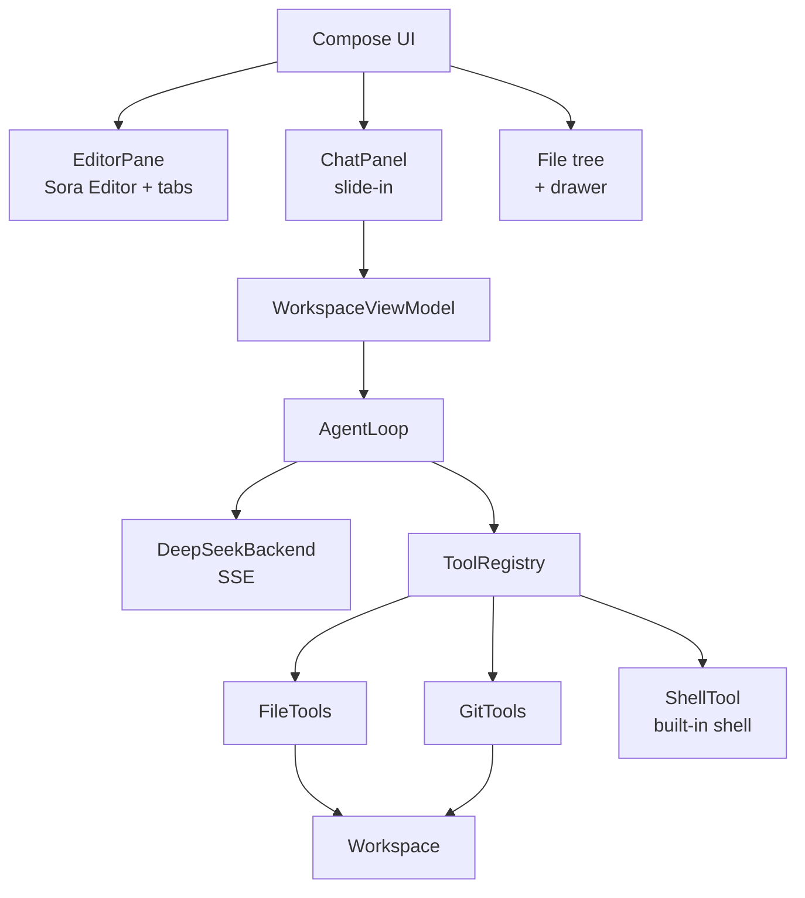

# Architecture

## The shape of the thing

Two decisions drive everything else.

### 1. The agent is an interface, not a vendor

`AgentBackend` is the seam. `DeepSeekBackend` is one implementation; a local model or an
ACP-backed agent could be another without the loop or the UI changing. DeepSeek is
OpenAI-compatible, so the client is roughly a generic completions client with DeepSeek's
`thinking` / `reasoning_effort` extras.

`AgentLoop` owns the agentic cycle: ask the model, execute whatever tools it requested, append
the results as `tool` messages, ask again — up to `maxToolRounds`, which exists purely to stop
a model that never stops calling tools.

### 2. All filesystem access goes through `Workspace`

`Workspace.resolve` canonicalizes every path and rejects anything outside the project root.
Tools never touch `File` directly for user-supplied paths. This is the only thing standing
between a confused model and `../../` walks, so it is deliberately the narrowest funnel.

## The tool set

| Tool | Purpose |
| --- | --- |
| `list_dir` | one directory level |
| `read_file` | numbered lines, paged with offset/limit |
| `write_file` | new files, or deliberate full rewrites |
| `edit_file` | exact-substring replacement, uniqueness enforced |
| `grep` | regex over contents, with a filename glob filter |
| `glob` | find paths by pattern |
| `git_status` | branch and working tree state |
| `git_diff` | unified diff, working tree or index |
| `run_command` | built-in mksh/toybox shell, always registered |

`edit_file` refuses to act when `old_string` matches more than once unless `replace_all` is
set. Models reach for the shortest unique anchor they can find, and a silent wrong-site edit is
far more expensive to debug than a retry.

## Deliberate limits on Android

- **No local toolchain.** The built-in shell is toybox. It cannot install packages or run a
  compiler, and the agent is instructed to say so rather than fake a result.
- **Context discipline.** The agent reads files through tools instead of having the project
  dumped into the prompt. Phones cannot afford a huge context, and it keeps the request cheap.
- **A single editor instance.** Switching tabs re-runs `setText`, which resets undo history and
  scroll. Retained per-file editor state is a later milestone.
- **Foreground work only.** A long agent run currently lives in the ViewModel's scope. Moving it
  to a foreground service is required before runs survive the app going to the background.

## Roadmap

1. **TextMate highlighting.** Bundle grammars and a theme as assets, register them with
   `GrammarRegistry`, and select a language by file extension. `EmptyLanguage` is in place now
   so the editor is honest about having no highlighting rather than looking broken.

   Blocked on tooling, not on the editor: `language-textmate` brings in tm4e, which is compiled
   against Java records, and AGP 8.7 dexes external libraries without the global synthetics that
   record desugaring needs (`Attempt to create a global synthetic for 'Record desugaring'`).
   Fix by upgrading AGP, or by dexing the grammars from source rather than consuming the AAR.
2. **Diff review.** Zed-style Accept/Reject per edit. `TextDiff` already produces the unified
   diff that the UI needs; today it only feeds the tool result text.
3. **Foreground service** for agent runs, so a long task survives backgrounding.
4. **Richer shell.** A real PTY and a way to add compilers without vendoring the Termux
   bootstrap, which is locked to `com.termux`.
5. **LSP and tree-sitter**, using the Sora Editor modules already declared in the catalog.
